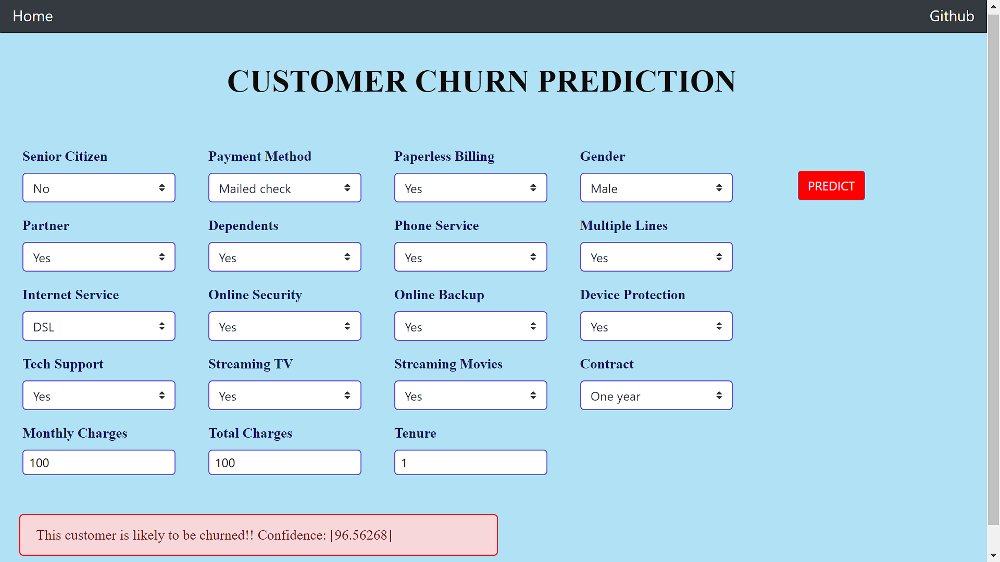

# Customer-Churn-Prediction
A web-application made with flask that predicts whether a customer will churn or not
   
Link to the Web Application: https://churn-prediction-webapp.herokuapp.com/

### Built with
<code></code>
<code></code>
<code></code>
<code></code>
<code></code>
<code></code>
<code></code>
<code></code>
<code></code>
<code></code>
<code></code>
 
 

### Exploratory Data Analysis
The data preprocessing and EDA can be found in the ***EDA.ipynb*** jupyter notebook.
The data was preprocessed to remove duplicates, the dropping the Null values as the percentage of Null values was small.
EDA techniques used include *univariate and bivariate analysis* to draw inferences about how the churn is *correlated* to different data features.
##### Inferences drawn from EDA:
- Customers who use *Electronic Check* are the higest churners
- Customers with *long term* contracts are *more likely* to churn than the customers with short term contracts
- Customers with *no tech support* churn more
- *Senior citizens* are *less likely* to churn compared to non senior citizens
   

### Model Building
This can be found in the ***Churn_Model.ipynb*** jupyter notebook
The numeric values such as *TotalCharges* and *MonthlyCharges* were used without any changes and the categorical values such as *gender*, *paymentMethod*, etc. were one hot encoded 
   
Initially the model was trained one the original preprocessed data with **Decision Tree** and the following results werwe obtained:
* Accuracy: ***0.79***
* Precision: ***0.74***
* Recall: ***0.71***
* F1 Score: ***0.72***

The performance of the model was not good, and was as expected because the dataset is **skewed**, with *less samples* for No Churn. *Upsampling* with **SMOTE-ENN** and retraining the model, significantly improved the performance of the model, with the following results:
* Accuracy: ***0.94*** 
* Precision: ***0.94***
* Recall: ***0.94***
* F1 Score: ***0.94***

Apart from decision tree, different models were trained such as **Random Forest Classifier** and **XGBoost**. On comparing the results no significant difference was found in the performance of these models.

### Web Application
The web applicatoin takes the input from the user for differnt features such as MonthlyCharges, Payment Method, Contract type, etc. and displays a message whether the customer with the given input features is likely to churn or not, along with the confidence of the prediction.
   
The front-end of the web application is made with **HTML**, **CSS, bootstrap** and in the back-end **Flask** is used. This web application is deployed on Heroku, and the link to it can be found at the top.
